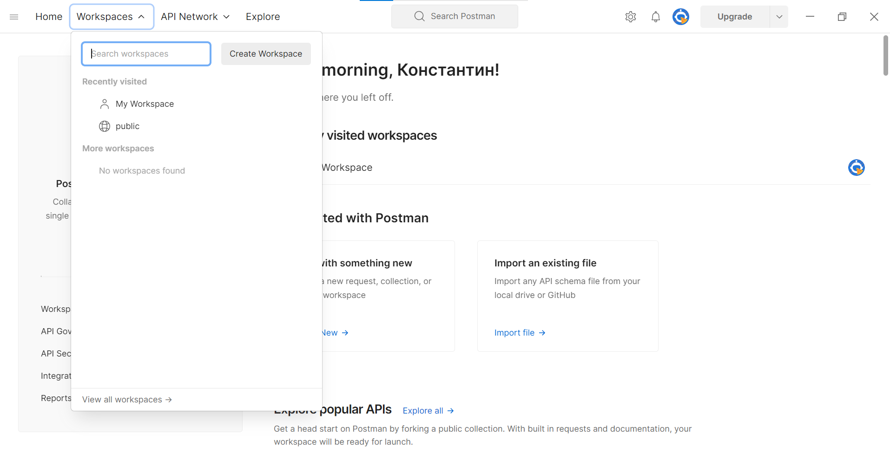
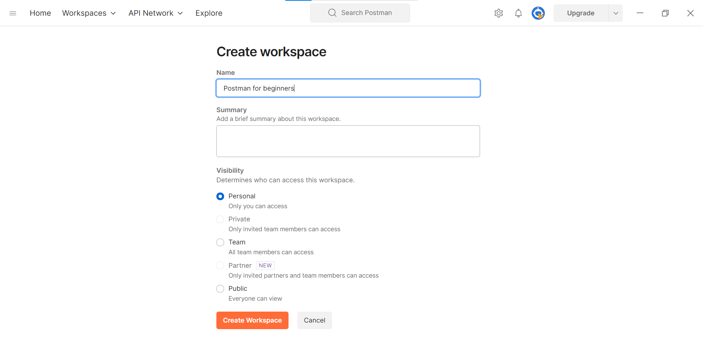
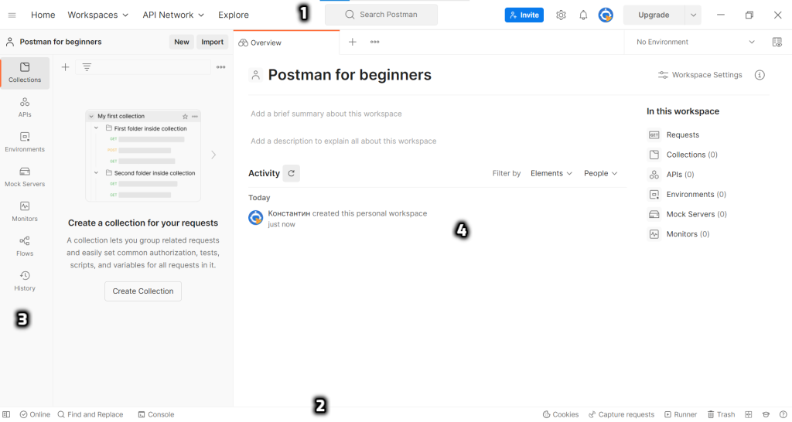

# Основные элементы интерфейса Postman

Сейчас мы кратко рассмотрим основные элементы Postman, необходимые для начала работы. Но для этого нам потребуется
создать новое рабочее пространство (**Workspace**). В верхнем меню выбираем соответствующий пункт и нажимаем кнопку
Create Workspace.

В открывшемся окне вводим название нашего рабочего пространства. Пусть это будет Postman for beginners. В поле Summary
можем добавить краткое описание. Затем можно указать уровень доступа. Т.к. я не планирую совместное использование своих
запросов с кем-то еще, выбираю настройку Personal. Это значит, что созданный workspace будет доступен только мне. В
конце нажимаем кнопку Create Workspace.

Теперь рабочее пространство создано и можем двигаться дальше. Перед нами окно приложения. Оно состоит из:

1. Верхнего меню.
2. Нижнего меню.
3. Бокового меню.
4. Основной зоны работы.

Верхнее меню дает возможность создания рабочего пространства (**Workspaces**) и доступа к различным api (**API Network
**). Также с его помощью можно делать поиск. **Home** - содержит вашу домашнюю страницу. На ней можно посмотреть вашу
недавнюю активность. С помощью **Workspaces** - можно создать новое рабочее пространство, выбрать одно из недавно
посещенных, либо сделать поиск по существующим.

В боковом меню доступны основные функциональные элементы Postman. В истории (**History**) вы можете увидеть сделанные
ранее запросы. Для более удобного хранения, группировки и поиска таких запросов в Postman есть коллекции (**Collections
**). К остальным элементам бокового меню мы вернемся позже. Если у вас небольшой экран, для удобной работы можно
свернуть боковое меню с помощью кнопки в нижнем левом углу.

Большая часть вашей работы в Postman будет проходить в основной рабочей зоне. Основные её части - вкладки, выпадающий
список для выбора окружения и правое боковое меню. К двум последним мы вернемся позже. Вкладки нам нужны, для лучшей
организации работы с запросами. Здесь Postman сделан по тому же принципу, что и браузеры, где новую странице удобнее
открывать в новой вкладке.

Далее мы рассмотрим другие элементы основной рабочей зоны и отправим первый запрос с помощью Postman.
