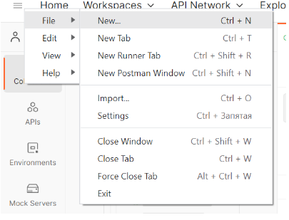
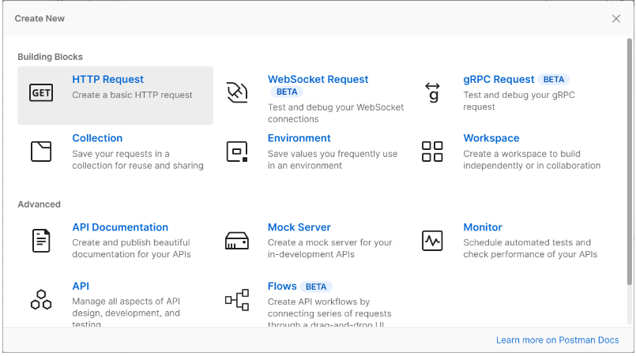
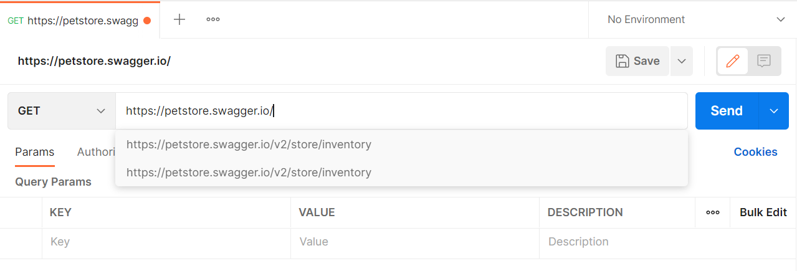

# Основные запросы

Запрос может содержать различную информацию, которая определяет какие данные Postman отправит при взаимодействии с API.
Обязательно нужно указать метод запроса и его URL. С их помощью определяется API эндпоинт, который предоставляет доступ
к определенной функциональности сервиса, с которой Postman будет взаимодействовать.

Для начала давайте попробуем отправить основные типы HTTP запросов.



Создадим новый запрос. Для этого в верхнем меню нужно выбрать File > New...



В появившемся окне в разделе Building Blocks выбираем HTTP Request. Либо можно рядом с существующими вкладками запросов
нажать + и создать новую вкладку.

## GET запрос.

Попробуем отправить GET запрос. GET - это один из основных методов HTTP протокола. Обычно такой тип запросов
используется для чтения данных. В GET запросе клиент запрашивает определенный ресурс, который находится на сервере, и
получает ответ от сервера в виде содержимого ресурса.

```
GET https://petstore.swagger.io/v2/store/inventory
```

Метод GET у нас уже выбран по умолчанию. Осталось указать URL нашего API. После того, как мы начнем вводить его, Postman
в выпадающем списке покажет нам ранее введенные адреса. В данном примере наш url состоит из двух частей.

Первая из них базовый(base) URL - это https://petstore.swagger.io. Она состоит из протокола https. Здесь чаще всего
будет использоваться либо https, либо http протокол. Затем идёт host, представленный доменным именем
petstore.swagger.io. Вместо него также может быть использован ip адрес хоста. И затем идет неявно указанный порт, в
нашем случае это 443. Указанный неявно - означает, что если вы добавите к запросу
порт : https://petstore.swagger.io:443, ничего не изменится т.к. этот же порт используется по умолчанию для протокола
https. Если же ваш запрос использует протокол http, порт по умолчанию будет 80. Если порт отличается от используемых по
умолчанию, потребуется явно указать его через двоеточие.

Вторая часть это путь(path) запроса. Он находится сразу после base url.



После ввода URL мы можем отправить запрос. Для этого нужно нажать кнопку Send. Через некоторое время после этого в
нижней части главного окна мы увидим ответ от сервера. Его содержимое мы рассмотрим позже, а пока давайте перейдем к
другим запросам.
