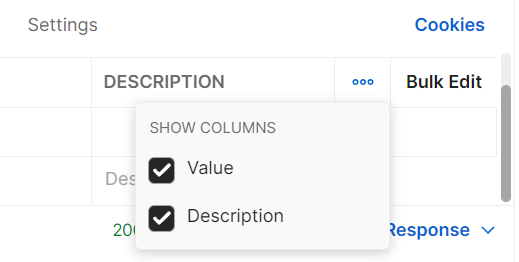

# GET запрос с query параметрами

В прошлый раз мы рассмотрели отправку запроса с path параметрами. Теперь давайте остановимся на другом типе параметров,
которые тоже передаются в строке запроса.

```
GET https://petstore.swagger.io/v2/pet/findByStatus?status=available
```

Они называются query параметрами или параметрами строки запроса. В HTTP-запросах они представляют собой дополнительные
данные, которые передаются в URL-адресе и используются для передачи на сервер, значение для фильтрации, поиска,
сортировки и т.д. Query-параметры могут использоваться вместе с любым HTTP-методом, но наиболее часто они используются с
методом GET.

От основной части url эти параметры отделяются знаком вопроса, а между собой знаком амперсанда. Каждый параметр
представляет собой пару из имени и значения, разделенную знаком равенства. Имена и значения могут быть закодированы,
используя механизм URL-кодирования, чтобы избежать ошибок при передаче специальных символов.

В данном примере мы используем запрос, который позволяет нам получить информацию о домашних питомцах отфильтрованную по
одному из статусов. Значение статуса для фильтрации передается через query параметр. Его имя status, а значение
available.


Если ввести такой параметр в строке запроса, он автоматически появится на вкладке Params, в таблице Query Params. Если
добавить его на вкладке Params, тогда он появится в строке запроса. Еще на этой вкладке у каждого параметра есть поле
description. В нем можно добавить описание к каждому из указанных параметров.



Как и для path параметров, здесь столбцы value и description можно скрыть. Для этого нужно нажать кнопку View more
actions и выбрать только нужные поля.

Path и query параметры можно как совмещать внутри одного запроса, так и использовать по отдельности. В отличии от path,
query параметры могут быть как обязательными так и необязательными. Обычно это указано в спецификации api метода.
Например в нашем случае, query параметр status является обязательным. Поэтому выполнение запроса без него приведет к
ошибке.

Еще одно отличие заключается в порядке указания параметров. Если ваш запрос содержит несколько path параметров, то
каждый из них должен находится в строго указанном месте. Query параметры могут быть указаны в произвольном порядке. На
результат выполнения запроса это никак не повлияет.
