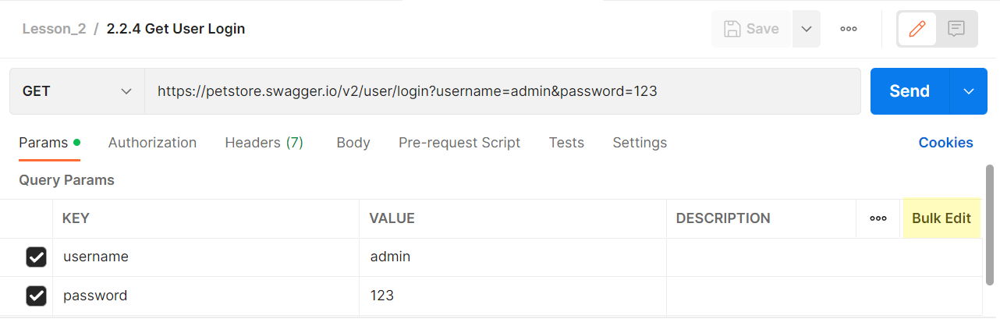
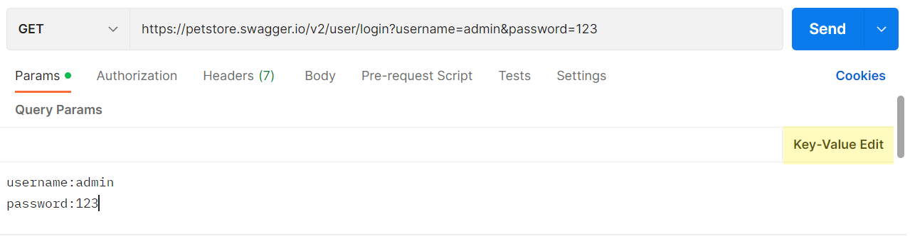

# Редактирование параметров через bulk edit.

В предыдущих примерах мы рассмотрели, как в Postman указать значения параметров в строке запроса или в таблицах path и
query параметров. Есть еще один способ, который будет удобен в тех случаях, когда параметров много. Давайте рассмотрим
запрос с несколькими параметрами.

```
GET https://petstore.swagger.io/v2/user/login?username=admin&password=123
```



Для его использования нужно нажать кнопку Bulk Edit в правой части таблицы Query Params. Вернуться обратно можно будет
нажав на кнопку Key-Value Edit.



В открывшемся окне можно вводить параметры. Каждый параметр вводится в новой строке. Имя и значение параметра
разделяются двоеточием. Например ранее введенный нами параметры username и admin будут выглядеть таким образом:

```
username:admin
password:123
```

Как и с предыдущим запросом, мы можем нажать кнопку Send для отправки и через несколько секунд внизу увидим ответ от
сервера.
