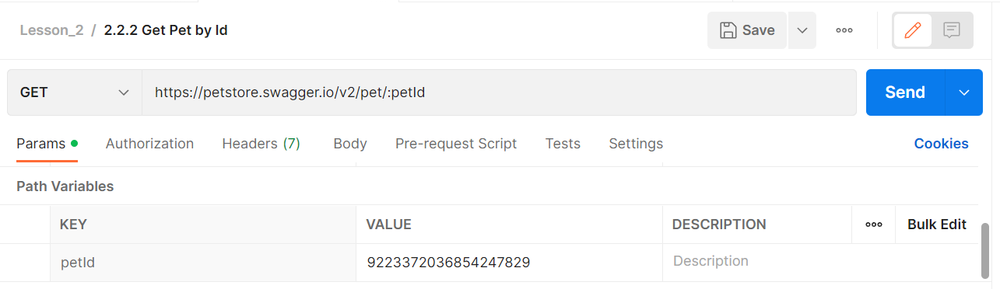

# GET запрос с path параметрами

В предыдущем примере запрос не содержал параметров, но иногда их требуется передавать на сервер. Они могут понадобиться
для передачи дополнительной информации в запросе и для уточнения его целей. Параметры могут использоваться для передачи
данных, которые необходимы для выполнения операции, определенной методом HTTP, и могут варьироваться в зависимости от
используемого метода. Например параметры могут использоваться для передачи настроек фильтрации, сортировки или поиска,
чтобы получить только нужные данные. Так же они могут использоваться для передачи данных, которые необходимо добавить на
сервер, для обновления или удаления существующих данных.

Таким образом, использование параметров в HTTP методах позволяет уточнить цели запроса, определить необходимые данные
для выполнения операции и передать их на сервер. Это делает HTTP методы более гибкими и позволяет использовать их в
различных сценариях, связанных с передачей данных через Интернет. В этом примере мы рассмотрим path параметры.

```
GET https://petstore.swagger.io/v2/pet/:id
```

Это параметры которые являются частью пути запроса. Они содержатся в части URL пути и используются для передачи данных,
которые определяют определенный ресурс на сервере и его характеристики. Path параметр можно указать только в одном,
строго указанном месте. В документации к api такие параметры часто задаются в фигурных скобках.

В данном примере мы будем использовать API для получения информации о домашнем питомце по его идентификатору в системе.
Его мы будем передавать на сервер с помощью path параметра id. После отправки такого запроса, в ответе от сервера придёт
информация о питомце, который имеет переданный нами идентификатор.


В Postman для добавления такого параметра в запрос, необходимо указать двоеточие перед его именем. После этого он
появится на вкладке Params, в таблице path параметров. Там же затем можно будет задать его значение в столбце value. Оно
будет использовано во время отправки запроса на сервер. Если path параметр присутствует в запросе, он является
обязательным. При попытке оставить его значение пустым, в ответе от сервера вы увидите ошибку.


В таблице Path Variables кроме value, присутствует поле description. В нем вы можете добавить описание к каждому из
параметров. Столбцы value и description можно убрать из таблицы. Для этого нужно нажать на три точки в правой части
таблицы. В появившемся меню оставить галки только возле полей, которые нужно показывать в таблице параметров.

В прошлом примере мы использовали имя параметра id, для лучшего понимания. Можно использовать любое другое имя,
результат выполнения запроса от этого не изменится.



Такой запрос будет аналогичен предыдущему и вернёт такой же ответ от сервера, не смотря на другое имя path параметра. Мы
можем даже передать значение через URL, не используя дополнительных параметров.


Такой вызов будет таким же, как и 2 предшествующих варианта, хотя в нем мы не используем таблицу path параметров
Postman. Вместо этого передаём значение параметра в URL.
