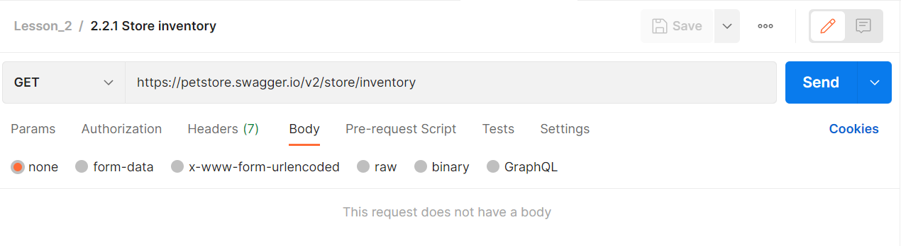

# Передача параметров в теле запроса

Иногда в запросе может потребоваться отправить больший объем данных чем пара ключ и значение, как это было в прошлых
примерах. Например вы хотите добавить нового пользователя. Будет не очень удобно передавать информацию о нем в виде path
или query параметров. Для таких случаев используется передача параметров в теле запроса. Обычно такой способ применяется
с POST, PUT и PATCH запросами. Информация о пользователе будет передана в теле запроса в виде XML или JSON.

XML (Extensible Markup Language) - это язык разметки, который используется для представления и передачи данных. Он был
разработан для того, чтобы облегчить обмен данными между различными системами. XML представляет собой текстовый формат,
который содержит теги, атрибуты и значения. Теги используются для определения элементов данных, а атрибуты позволяют
указывать дополнительные характеристики для этих элементов. Значения могут быть текстовыми или другими элементами
данных.

```xml

<person>
    <name>Ivan</name>
    <lastname>Petrov</lastname>
    <age>28</age>
    <address>
        <street>Lenina str.</street>
        <city>Moscow</city>
    </address>
</person>
```

Этот объект в формате XML, представляет человека с именем Ivan, фамилией Petrov, возрастом 28 лет, живущего в Москве, на
улице Ленина.

JSON (JavaScript Object Notation) - это легковесный формат для передачи данных, основанный на синтаксисе объектов
JavaScript. Он используется для обмена данными между клиентом и сервером в интернет-приложениях. JSON представляет
данные в виде пар имени и значения, где имя - это строка, а значение может быть строкой, числом, логическим значением,
массивом, объектом или null.

```json
{
  "name": "Ivan",
  "lastname": "Petrov",
  "age": 28,
  "address": {
    "street": "Lenina str.",
    "city": "Moscow"
  }
}
```

Этот объект в формате JSON, аналогичен предыдущему. Так же представляет человека с именем Ivan, фамилией Petrov,
возрастом 28 лет, живущего в Москве, на улице Ленина.

Давайте рассмотрим основные отличия JSON и XML:

+ Обычно данные в формате JSON имеют меньший размер, чем XML-данные, благодаря своему более компактному синтаксису.
+ JSON использует более простой и компактный синтаксис, чем XML.
+ XML-файлы обычно более читабельны, чем JSON-файлы, потому что XML использует явные теги и атрибуты, которые часто
  легче понимать, чем названия полей в JSON.
+ XML позволяет более глубокую вложенность, чем JSON, что может быть полезно для некоторых типов данных.

В целом, JSON и XML имеют свои преимущества и недостатки, и выбор того, какой формат использовать, зависит от конкретных
потребностей приложения.



Давайте вернемся в Postman и откроем вкладку body. На ней вы можете задать нужные данные, которые будут отправлены
вместе с запросом. Там же можно выбрать тип отправляемых данных. В предыдущих запросах по умолчанию Postman для тела
запроса использовал тип none.

Тип данных в теле запроса определяется из заголовка. Заголовки HTTP (HTTP headers) - это часть HTTP-запроса и ответа,
которая передается между клиентом и сервером. Они содержат метаданные, необходимые для правильной обработки запроса и
ответа. С помощью заголовков HTTP можно указать например тип передаваемого содержимого. Заголовок content-type в HTTP
необходим для указания типа содержимого (например, текст, изображение, аудио или видео), передаваемого в теле запроса
или ответа. Это позволяет получателю запроса или ответа правильно интерпретировать содержимое и выбрать соответствующий
способ его обработки. Если этот заголовок отсутствует или указан неверно, это может привести к неправильной обработке
содержимого или даже к ошибкам при его отображении. Поэтому правильное использование заголовка content-type очень важно
для правильной обработки запросов и ответов в протоколе HTTP.

Если вы планируете отправлять данные в теле запроса необходимо убедиться, что добавлен правильный заголовок
content-type. Он нужен для того, чтобы api мог корректно обработать полученный запрос. Для типов form-data и
x-www-form-urlencoded Postman автоматически добавит в заголовки нужный content-type. Если вы планируете использовать тип
raw, Postman добавит заголовок на основе выбранного вами типа (например json или text). Для типа binary Postman не будет
добавлять никаких заголовков. Заданный вручную заголовок content-type переопределяет значение, указанное Postman.

+ form-data - этот формат в HTTP используется для передачи данных, которые представляют собой набор пар "ключ-значение".
  Такой тип часто используется при отправке данных формы на сайтах. Каждая пара соответствует одному элементу формы,
  например, текстовому полю, флажку и т.д. Еще с помощью формата form-data можно передавать файлы.
+ Формат x-www-form-urlencoded внешне очень похож на form-data. Здесь данные также передаются в формате ключ-значение.
  Основное отличии от form-data, здесь мы не можем передавать файлы и указывать тип данных для каждого из полей.
+ binary - это формат, который предназначен для отправки бинарных данных. Он используется для передачи бинарных данных,
  таких как изображения, аудио, видео и другие файлы.
+ raw - предназначен для отправки текстовых данных в различных форматах, таких как: Text, JavaScript, JSON, HTML и XML.
+ GraphQL - позволяет отправлять запросы на языке запросов GraphQL. В рамках этого курса этот тип запросов не будет
  рассматриваться, но если вам интересно можете ознакомиться с ним самостоятельно
  на [официальной странице GraphQL](https://graphql.org/).

Далее мы рассмотрим эти варианты передачи параметров в теле запроса подробнее.
