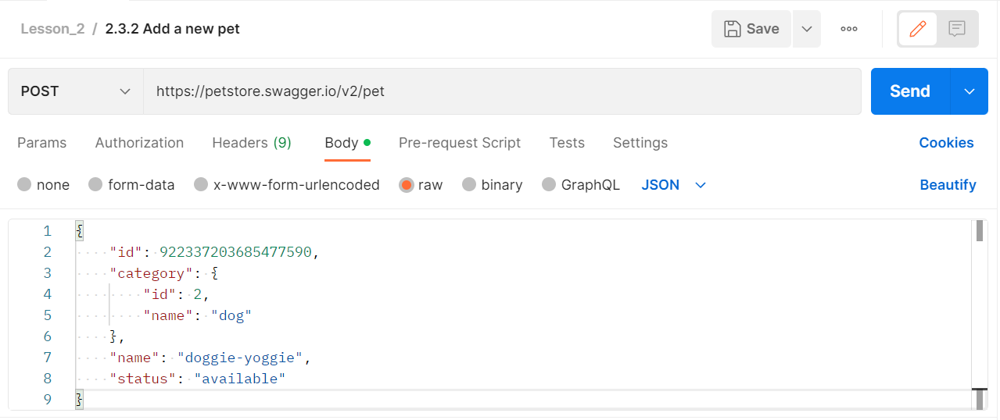
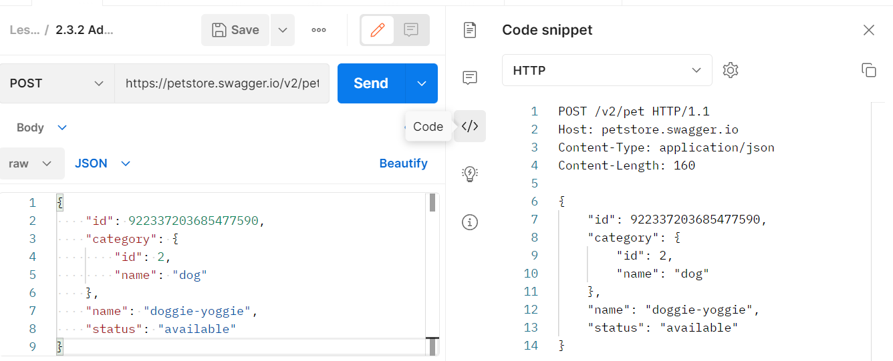
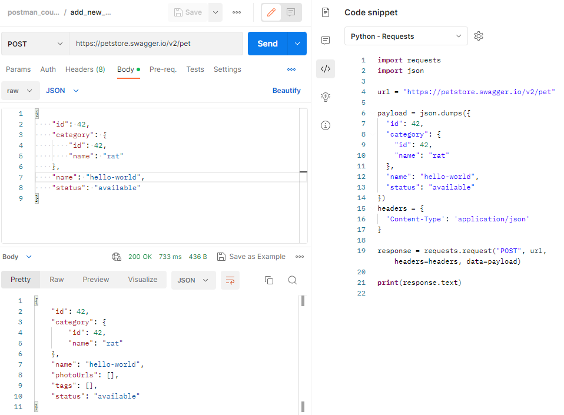

# Добавление новых данных с помощью POST запроса

Давайте подробнее рассмотрим метод POST. Он является одним из методов запросов HTTP, используемых для отправки данных на
сервер. Этот метод позволяет клиенту отправлять данные в теле запроса на сервер, который обрабатывает эти данные и
возвращает ответ. Часто метод POST используется для отправки данных формы, таких как входные данные пользователя,
поисковые запросы, комментарии и т.д. Кроме того, метод POST может использоваться для загрузки файлов на сервер.

Сейчас мы рассмотрим, как с помощью Postman отправить POST запрос для создания записи о новом домашнем животном, в нашем
тестовом API. Для этого будем использовать следующий эндпоинт:

```
POST https://petstore.swagger.io/v2/pet
```

```json
{
  "id": 922337203685477590,
  "category": {
    "id": 2,
    "name": "dog"
  },
  "name": "doggie-yoggie",
  "status": "available"
}
```

В отличие от предыдущих примеров, этот запрос не содержит параметров в строке запроса. Здесь мы будем передавать данные
для создания записи в теле запроса. Запись о новом домашнем животном будет представлена в виде JSON объекта, в прошлом
видео мы уже познакомились с подобными данными.



На вкладке Body мы выбираем тип raw. Затем в выпадающем списке из всех значений выбираем JSON. Это нужно для того, чтобы
Postman мог подставить нужный тип контента в заголовок запроса. Кроме того, это улучшит отображение объекта в окне
ввода, т.к. Postman включит подсветку синтаксиса. Для данного запроса объект будет иметь следующий вид:

Поле id - это идентификатор домашнего животного. Здесь может быть указано любое число. Если вы захотите добавить свое
домашнее животное поменяйте его значение. Только не вводите слишком длинных чисел, в этом случае запрос может
выполниться с ошибкой. Далее идет категория, в которой задается её идентификатор и название. Затем в поле name мы задаём
имя нашего животного. В последнем поле задается статус. Там можно указать одно из трех значений : available, pending или
sold.

Кстати в Postman есть одна полезная фича. Открыв в правом боковом меню пункт Code, вы можете посмотреть как будет
выглядеть ваш HTTP запрос. Для этого в выпадающем списке нужно выбрать HTTP. Там также можно найти и другие формы
запроса, например CURL, но сейчас мы не будем на них останавливаться подробно, а рассмотрим наш запрос. Именно в такой
форме наш запрос отправляется на сервер для обработки.



В начале идет стартовая строка. В ней мы видим метод нашего запроса - POST. Затем идёт наш эндпоинт /v2/pet. HTTP/1.1 -
означает версию используемого протокола. В нашем случае это HTTP 1.1. Она определяет структуру следующих за стартовой
строкой данных. Затем идут заголовки запроса, в которых передается адрес хоста petstore.swagger.io, на который мы
отправляем запрос. Тип наших данных application/json, в которых мы передаём информацию о домашнем питомце, которого мы
хотим добавить. И длина этих данных в заголовке Content-Length, которую Postman сам посчитал и добавил в заголовки
запроса. Затем идет тело запроса, которое отделяется от заголовков пустой строкой. В нем передается JSON, который мы
задали в окне body.


