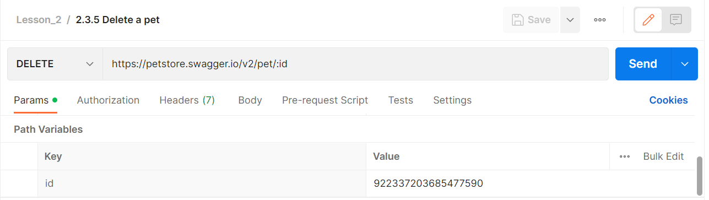
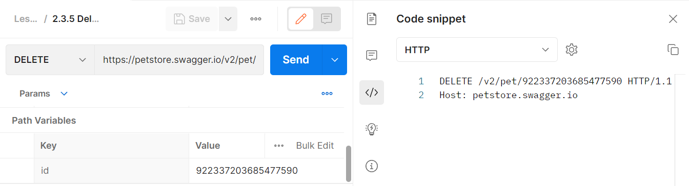
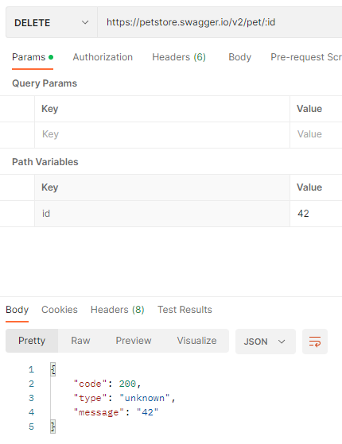

# Удаление данных с помощью DELETE запроса

В протоколе HTTP, DELETE запрос используется для удаления указанного ресурса, находящегося на сервере. Это может быть
например удаление учетной записи пользователя или удаление файла с сервера. Таким образом, DELETE-запрос может быть
полезен во многих ситуациях, когда необходимо удалить ресурс с сервера. Далее мы рассмотрим, как с помощью Postman
отправить DELETE запрос для удаления записи о существующем домашнем животном, в нашем тестовом API. Для этого будем
использовать следующий эндпоинт:

```
DELETE https://petstore.swagger.io/v2/pet/:id
```

В отличии от предыдущих примеров, этот запрос не содержит параметров в теле запроса. Единственное, что будет нужно
передать на сервер - это идентификатор питомца. Это делается с помощью path параметра id. В Postman данный запрос будет
иметь следующий вид:



Поле id - это идентификатор домашнего животного. Его можно взять из предыдущих запросов. Перед отправкой запроса на
сервер, давайте посмотрим, как он будет выглядеть. Для этого откроем вкладку Code в правом боковом меню и выберем тип
HTTP.



Там мы увидим, что в этот раз метод запроса у нас DELETE, т.к. с его помощью происходит удаление данных в нашем API. Из
заголовков запроса остался только host. Также исчезло тело запроса, поскольку здесь мы его не передаем. Теперь давайте
отправим наш запрос на сервер, нажав на кнопку Send.



Теперь давайте выполним GET запрос, одного из прошлых уроков. С его помощью получим данные нашего домашнего животного по
его идентификатору.
