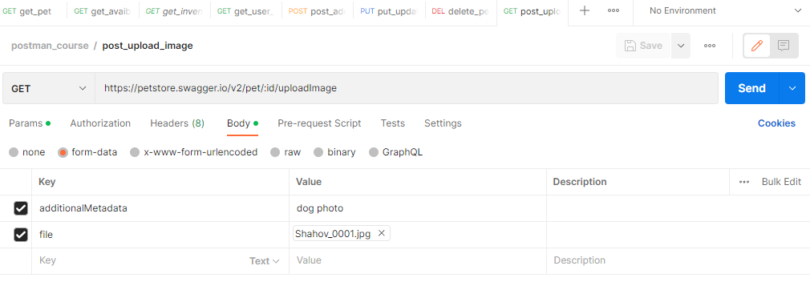
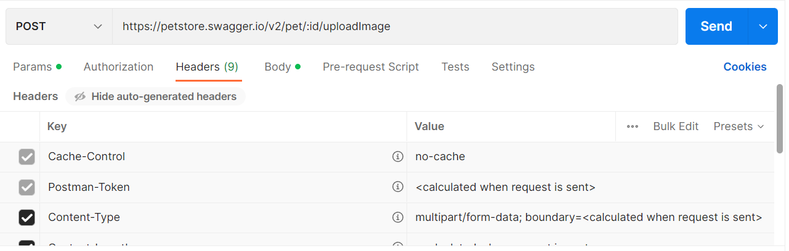
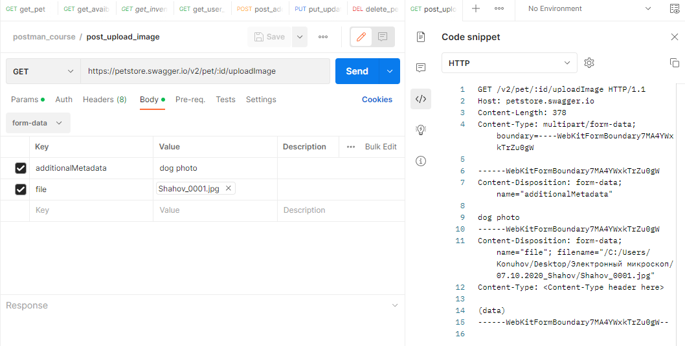
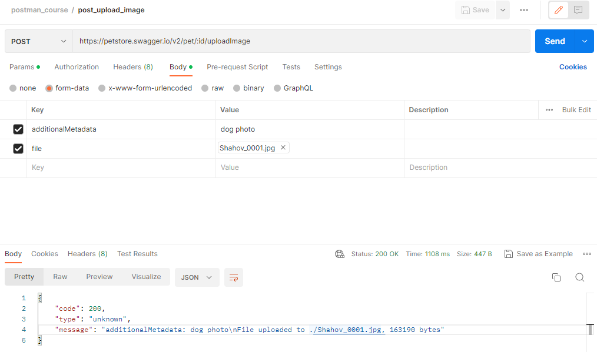

# Передача данных в формате multipart/form-data

В этом уроке мы рассмотрим еще один POST запрос. В нем мы снова будем обновлять данные нашего питомца, но в этот раз
будет использован другой формат передачи данных. Он называется multipart/form-data и имеет такой же заголовок
content-type. Такой тип контента в HTTP запросах, может быть использован для отправки файлов или данных формы на
сайтах. Когда вы отправляете такие, в браузере создается запрос, тело которого состоит из нескольких частей. Между ними
размещаются границы (boundary), которые помогают серверу разделить данные на отдельные части. Давайте посмотрим, как
отправить такой запрос используя Postman.

```
POST https://petstore.swagger.io/v2/pet/:id/uploadImage
```

Будем использовать следующий эндпоинт. С его помощью мы можем добавить фото для нашего питомца. Идентификатор питомца,
как и раньше, передается через path параметр. Два других параметра - фото питомца и дополнительная информация,
передаются через параметры в form-data.



В Postman для отправки подобного запроса, на вкладке body необходимо выбрать тип form-data. Далее в таблице необходимо
добавить данные, которые мы будем отправлять. Первый параметр называется additionalMetadata. В нем мы передаем текст,
содержащий дополнительную информацию. Тип параметра оставим без изменений. Во втором параметре будем передавать фото
питомца. Имя параметра - file. Затем в выпадающем меню нужно выбрать тип параметра - file. Теперь нужно нажать на select
files и указать файл, который мы хотим передать на сервер. Настройка видимости полей в таблице и bulk edit мы уже
разбирали в прошлых уроках. Здесь они работают аналогично path и query параметрам.



Откроем вкладку headers. Т.к. мы уже выбрали формат передачи данных form-data, Postman сам добавил в заголовки
content-type = multipart/form-data. Рядом с ним, динамически добавляется граница(boundary). Postman создаст её
автоматически, чтобы потом подставить в тело запроса во время отправки на сервер.



Давайте посмотрим, как будет выглядеть наш запрос во время отправки на сервер. Для этого откроем вкладку Code в правом
боковом меню и выберем тип HTTP. В первой строке видим метод POST, указанный в запросе эндпоинт и версию протокола HTTP.
Затем в заголовках указаны host и длина контента. Следом в заголовке content-type указан наш тип контента
multipart/form-data и boundary, которым в теле запроса будут разделяться его части. Затем идёт тело запроса. Каждая его
часть отделяется от других строкой boundary, которая была указана выше.



Отправим наш запрос, нажав на кнопку Send. В ответе видим успешный код 200 OK. В теле ответа содержится JSON объект.
Поле message содержит текст с данными, которые мы передали в запросе.
