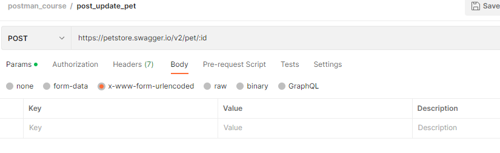
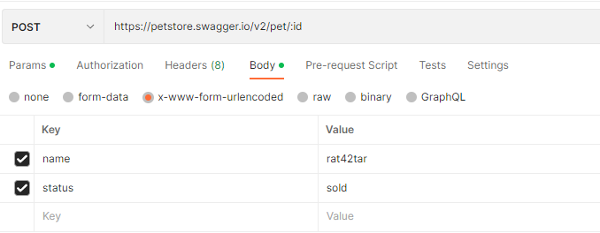
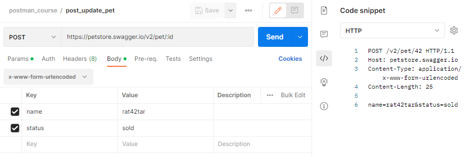
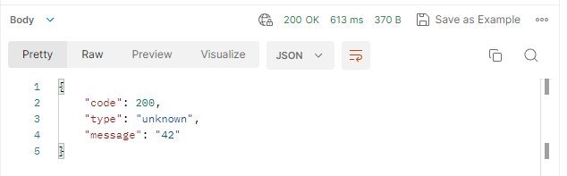
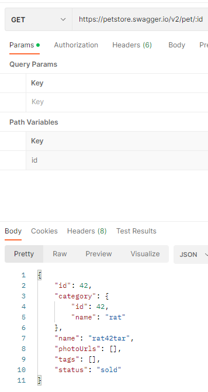

# Передача данных в формате x-www-form-urlencoded

Данный формат используется для передачи данных в теле запроса, чаще всего для методов POST и PUT. Данные передаются в
виде пар ключ-значение, разделенных символом "&", а ключ и значение разделяются символом "=". Значение каждого ключа и
значения могут быть закодированы в формат URL-кодирования, чуть позже в примере мы рассмотрим, как это будет выглядеть.
Этот формат является стандартным способом передачи данных в HTML-формах, а также используется в других API и
веб-сервисах. Этот формат является простым и удобным для использования, поэтому он широко применяется в HTTP-запросах.

Этот формат похож на рассмотренный ранее form-data, но между ними есть следующие отличия:

+ Все отправленные значения могут быть закодированы в формат URL-кодирования.
+ В отличии от form-data здесь у нас нет возможности передавать файлы.
+ Нельзя указать отдельный content-type для каждого из параметров.

```
POST https://petstore.swagger.io/v2/pet/:id
```

С помощью эндпоинта, который мы сейчас используем можно обновить некоторые данные нашего питомца. Идентификатор питомца
снова передается через path параметр. Два других параметра - имя питомца и статус, передаются через параметры
x-www-form-urlencoded.



Для отправки подобного запроса в Postman, на вкладке body необходимо выбрать соответствующий тип x-www-form-urlencoded.
Далее в таблице нам нужно указать данные, которые мы хотим отправить. Имя первого параметра name. В нем мы передаем нове
имя нашего питомца. Во втором параметре будем передавать его статус. Имя параметра - status. Настройку видимости полей в
таблице и bulk edit мы уже разбирали в прошлых уроках. Здесь они работают аналогично.



Перейдем на вкладку headers. Т.к. мы уже выбрали формат передачи данных form-data, Postman сам добавил в заголовки
content-type = application/x-www-form-urlencoded. Postman создаст её автоматически, чтобы потом подставить в тело
запроса во время отправки на сервер. В отличии от типа form-data, здесь отсутствует граница (boundary), т.к. в теле
запроса она не потребуется.



Теперь посмотрим, как выглядит наш запрос при отправке на сервер. Откроем вкладку Code в правом боковом меню и выберем
тип HTTP. В первой строке видим метод POST, указанный в запросе эндпоинт и версию протокола HTTP. Затем в заголовках
указаны host и длина контента. В заголовке content-type указан наш тип контента application/x-www-form-urlencoded. Затем
идёт тело запроса. Теперь оно выглядит иначе, все параметры идут в виде пар ключ-значение. Между собой они разделены
символом "&", а ключ и значение разделяются символом "=". Обратите внимание на значение первого параметра name. В нем
вместо пробела идёт значение '%20'. Это и есть URL-кодирование, о котором мы говорили ранее.






Отправим наш запрос, нажав на кнопку Send. В ответе видим успешный код 200 OK. В теле ответа содержится JSON объект.
Поле message содержит идентификатор домашнего питомца, который мы передали в запросе.
