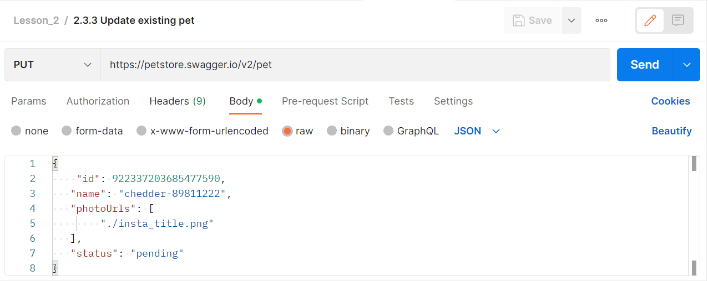
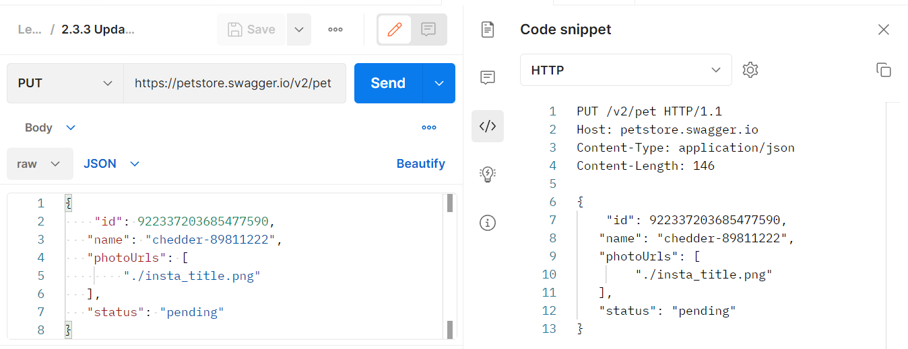
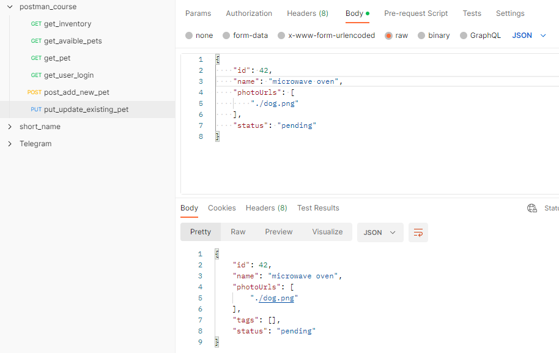

# Обновление с помощью метода PUT

В предыдущем видео мы добавляли нового питомца используя метод POST с данными в теле запроса. Теперь попробуем отправить
PUT запрос. Обычно он используется для того, чтобы обновить существующие данные. Наш PUT запрос будет выглядеть
следующим образом:

```
PUT https://petstore.swagger.io/v2/pet
```

```json
{
  "id": 922337203685477590,
  "name": "chedder-89811222",
  "photoUrls": [
    "./dog.png"
  ],
  "status": "pending"
}
```

В данном примере идентификатор в поле id совпадает с созданным в прошлом уроке. Имя питомца мы хотим изменить, поэтому в
поле name указано новое значение. Также мы изменяем статус, поэтому здесь вместо available указано значение pending.
Также мы добавляем параметр photoUrls, имеющий ссылку на картинку и убираем категорию, которую указывали при создании.

Как и в предыдущем примере, здесь в теле запроса можно передавать текстовые данные, различных форматов. Для этого
используется вариант передачи данных: raw. В выпадающем меню можно выбрать формат передаваемых данных. Доступные
форматы: Text, JavaScript, JSON, HTML и XML. В этот раз мы снова будем передавать JSON. Он будет содержать обновленные
сведения о нашем домашнем питомце. Для данного запроса объект будет иметь следующий вид:



На вкладке Body мы вновь выбираем тип raw. Затем в выпадающем списке из всех значений выбираем JSON и Postman
автоматически подставит нужный тип контента в заголовок запроса. Кстати в Postman для данных в формате JSON и XML
появляется кнопка Beautify. С ее помощью можно переформатировать текстовые данные для красивого отображения в окне
ввода.



Теперь давайте посмотрим, как наш запрос будет выглядеть во время отправки на сервер. Для этого выберем Code в правом
боковом меню. Там видим, что в этот раз у нас другой метод запроса, т.к. обновление данных у нас происходит с помощью
PUT и изменилось значение заголовка Content-Length, поскольку тело запроса стало короче. Ну и само тело запроса у нас
изменилось. Отправим наш запрос на сервер, нажав на кнопку Send.



Теперь давайте выполним GET запрос, одного из прошлых уроков. С его помощью получим данные нашего домашнего животного по
его идентификатору. В ответе от сервера увидим, что теперь нам приходят обновленные данные. Подробнее ответы от сервера
мы рассмотрим в следующих уроках, здесь мы только хотели убедиться, что данные о питомце обновились.
