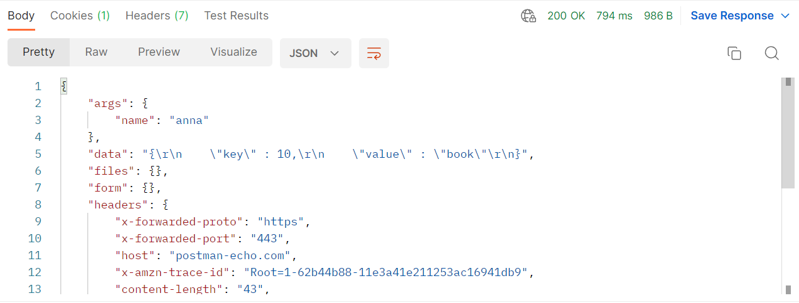
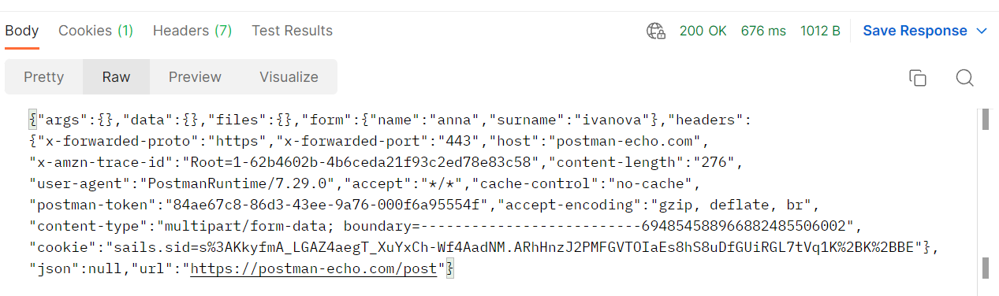

# Работа с ответами

До сих пор мы рассматривали запросы к API. Теперь давайте подробнее остановимся на том, что нам приходит в ответе от
сервера. Postman поможет нам с просмотром ответов. В нем есть возможность визуализации тела ответа, а также проверки его
корректности. Основные части ответа - это код ответа, заголовки и тело ответа. Рассмотрим их более детально.

```
POST https://postman-echo.com/post?name=anna
```

Воспользуемся одним из предыдущих запросов. Укажем тип и url запроса, нажмем кнопку Send. Через некоторое время после
этого в нижней части главного окна мы увидим ответ от сервера. Его содержимое мы будем рассматривать далее.

## Тело ответа

В Postman тело ответа мы можем посмотреть в нижней части главного экрана, на вкладке body. Она предоставляет несколько
инструментов, которые помогут эффективнее работать с ответами от api. Это 4 вида представления тела ответа: Pretty, Raw,
Preview и Visualize. В первых двух доступна функция поиска в запросе. Для открытия окна поиска нужно будет выбрать
иконку поиска или нажать сочетание клавиш ⌘+F или Ctrl+F. В Postman доступен автоматический показ изображений в теле
ответа, если он содержит соответствующий заголовок content-type.

Форматированный(Pretty) вид - представление тела запроса для форматов JSON и XML. Этот вид автоматически форматирует
полученный ответ для более легкого восприятия. Применяется удобная подсветка различных частей текста.



Postman делает форматирование автоматически, на основе пришедшего заголовка content-type. Для принудительного изменения
форматирования, можно воспользоваться выпадающим списком для выбора иного формата, рядом с кнопкой Visualize.

Если вы работаете только с форматом Json, можно выставить принудительное форматирование в этом формате. Для этого в
верхнем меню нужно выбрать раздел настроек (Settings). На вкладке General найти настройку определения языка (Language
detection). Затем поменять ее значение с Auto на Json.



Неформатированный (Raw) вид - текстовое представление тела ответа, без дополнительного форматирования. Позволяет
просмотреть его в полученном виде.

Предпросмотр (Preview) - этот вид позволяет удобно просматривать полученное содержимое в обработанном виде. Это может
быть удобно например в случае получения стандартных ошибок, которые приходят в виде Html страницы.

Для бинарных типов данных в ответах, таких как аудио файлы, pdf документы, zip архивы или что-то другое вы можете
воспользоваться кнопкой Send and download, чтобы сохранить ответ и проверить его локально на своем компьютере.

Визуализация (Visualize) - позволяет обработать полученный ответ собственным способом. Код для визуализации добавляется
отдельно. Этот способ мы рассмотрим позднее.
