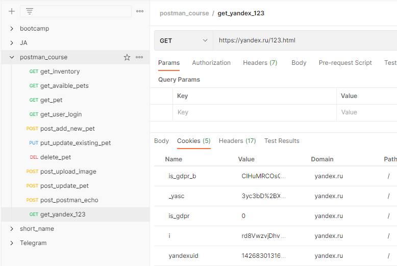
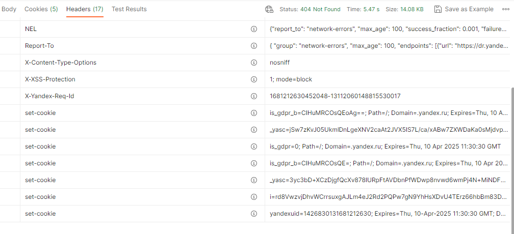
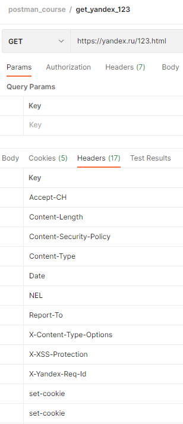

# Заголовки и cookies

В Postman, на вкладке Cookies можно просмотреть все куки отправленные сервером. Каждая запись будет содержать имя,
значение, домен и путь, а также дополнительную информацию. В протоколе HTTP Cookies используются для хранения некоторой
информации на стороне клиента. Она может быть использована для идентификации пользователей, сохранения настроек и
предпочтений пользователей. Когда пользователь посещает веб-сайт, сервер отправляет на его компьютер специальный файл
cookie, который затем сохраняется в браузере. Этот файл содержит информацию, которую сервер может использовать при
последующих запросах от этого пользователя.

С помощью cookies веб-сайты могут например сохранять информацию о предпочтениях пользователя, таких как язык или
настройки отображения. Предоставлять персонализированный контент, например определение региона пользователя или
рекомендации товаров. Сохранять данные аутентификации пользователя, такие как логин и пароль, чтобы пользователь мог
оставаться залогиненным на сайте. Следить за активностью пользователя на сайте, чтобы анализировать его поведение.
Однако, в связи с тем, что cookies могут использоваться для отслеживания пользовательской активности, многие браузеры
позволяют пользователям управлять их использованием, например, блокировать cookies от определенных сайтов или включать
режим инкогнито.

На вкладке headers отображается информация о полученных заголовках, в формате ключ-значение. Если навести мышку на
иконку информации, в поле с именем заголовка, можно получить информацию о каждом из них, в соответствии со спецификацией
протокола HTTP.

Заголовки HTTP являются частью протокола HTTP. Они содержат метаданные о запросе или ответе, которые могут быть
использованы для управления сеансом передачи данных, определения типа контента, управления кэшированием, аутентификации
и многих других задач. Некоторые примеры использования заголовков HTTP:

+ **Контроль кэширования**. Заголовки HTTP могут указывать, должны ли браузеры кэшировать ресурс и на какой период
  времени.
  Это позволяет уменьшить количество запросов к серверу и ускорить загрузку страниц.
+ **Аутентификация**. HTTP заголовки могут использоваться для передачи информации об аутентификации, такой как токен
  доступа
  или логин и пароль. Это позволяет защитить ресурсы, доступ к которым должен быть ограничен.
+ **Управление сеансом**. Здесь заголовки HTTP могут указывать, должны ли браузеры сохранять данные о сеансе и как долго
  они
  должны храниться. Это может быть использовано для создания персонализированных сеансов для каждого пользователя.
+ **Определение типа контента**. В этом случае HTTP заголовки могут указывать тип контента, который возвращается
  сервером,
  например, HTML, изображение или документ PDF. Это помогает браузеру правильно отображать контент и обрабатывать его
  соответствующим образом.

В целом, заголовки HTTP играют важную роль в управлении передачей данных между веб-серверами и веб-браузерами, позволяя
контролировать поведение браузеров и обеспечивать более безопасную, эффективную и удобную работу с веб-ресурсами.
Существует множество заголовков HTTP, каждый из которых выполняет свою задачу. Вот некоторые из наиболее
распространенных заголовков HTTP, которые используются веб-серверами и браузерами:

+ **User-Agent** - позволяет серверу идентифицировать браузер или другое приложение, которое отправляет запрос на
  сервер.
+ **Content-Type** - указывает тип контента, возвращаемого сервером, например, текст, HTML, JSON, изображение и т.д.
+ **Content-Length** - указывает размер содержимого ответа в байтах.
+ **Cache-Control** - позволяет определить, должен ли браузер кэшировать ответ и на какой период времени.
+ **Accept** - позволяет клиенту указать типы контента, которые он готов принять от сервера.
+ **Authorization** - используется для передачи информации об аутентификации, например, токен доступа или логин и
  пароль.
+ **User-Cache-Control** - позволяет клиенту управлять кэшированием ответа на стороне браузера.

Это лишь некоторые из наиболее распространенных заголовков HTTP, которые могут использоваться при передаче данных между
веб-серверами и веб-браузерами. Конкретные заголовки, используемые в каждом запросе или ответе, зависят от конкретных
требований и настроек сервера и клиента. В случае отправки HEAD запроса, Postman откроет вкладку Headers по умолчанию,
вместо вкладки Body.

Результаты тестов (Test results) расположенные на вкладке с таким же названием, мы рассмотрим позднее.
