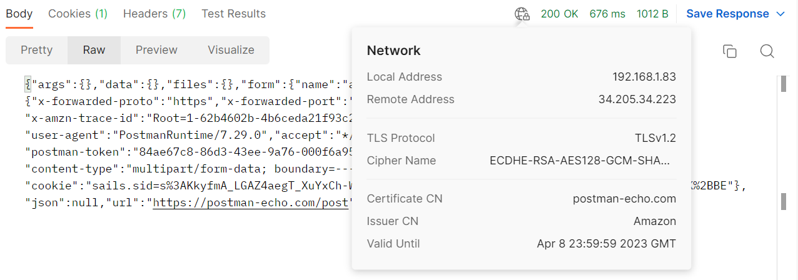
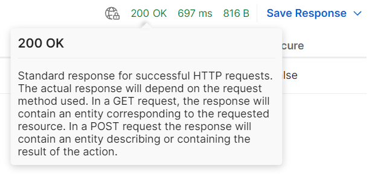
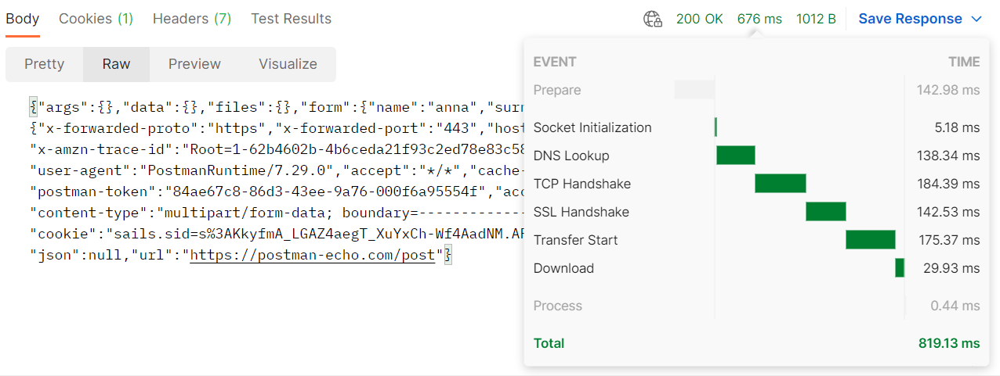

# Информация об ответе

Postman также отображает сетевую информацию при отправке запроса. Наведите мышку на иконку глобуса рядом со статус
кодом.

Далее идет код ответа, который вернул API. Наведите курсор на сам код для получения описания того, что он означает.

Код ответа HTTP - это числовой код, который возвращает сервер в ответ на HTTP-запрос от клиента. Код ответа состоит из
трех цифр, где первая цифра указывает на класс ответа, а две последующие цифры - на конкретный код ответа внутри этого
класса. Классы кодов ответа HTTP делятся на 5 групп:

+ Информационные (Info) - начинаются с цифры 1. Они сообщают клиенту, что запрос получен, и сервер продолжает обработку.
+ Успешные (Success) - начинаются с цифры 2 и сообщают клиенту, что запрос выполнен успешно.
+ Перенаправления (Redirect) - начинаются с цифры 3. Сообщают клиенту, что дополнительные действия должны быть выполнены
  для завершения запроса.
+ Ошибки клиента (Client Error) - начинаются с цифры 4 и сообщают клиенту, что запрос был сформулирован неправильно или
  не может быть выполнен.
+ Ошибки сервера (Server Error) - начинаются с цифры 5. Они сообщают клиенту, что запрос не может быть выполнен из-за
  ошибки на стороне сервера.

Коды ответа HTTP могут помочь в понимании, что произошло в процессе запроса и ответа на сервере. В дальнейшем это
поможет правильно обработать ответ от сервера в своем приложении или браузере. Например, код 200 означает, что запрос
был выполнен успешно, а код 404 означает, что запрошенный ресурс не найден на сервере. Чаще всего вы будете работать с
успешными кодами ответа, а также с кодами ошибок клиента и сервера.

Затем следует время и размер ответа. Postman автоматически посчитает время ответа от сервера в миллисекундах. Эта
информация может быть полезна, при анализе причин слишком долгих ответов. При наведении курсора на число, отображается
разбиение этого времени по различным фазам ответа.

Далее Postman отображает примерный размер ответа. При наведении на число можно увидеть размер тела ответа и заголовков.

Еще в Postman есть функция сохранения ответов от сервера. Если запрос был сохранен в коллекцию, вы также можете
сохранить и ответ для него. Для этого выберите Save Response, затем Save as example. Либо сохраните ответ в файл, выбрав
Save to a file.
