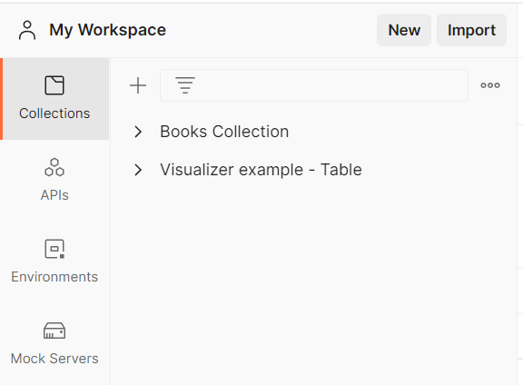
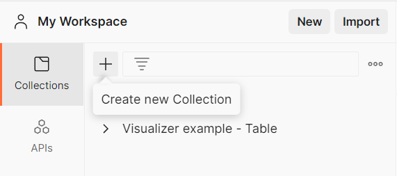
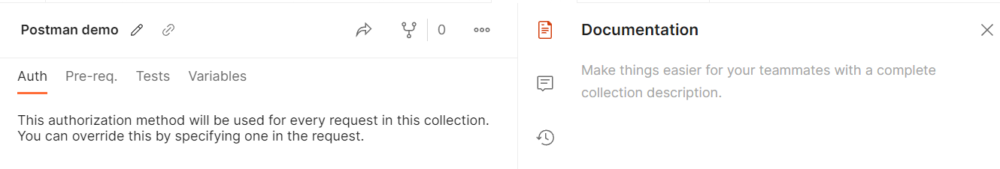

# Создание коллекции и добавление запросов

В Postman вы можете группировать запросы и примеры ответов в коллекции. Это поможет удобнее организовать свое рабочее
пространство, создавать тестовую документацию и тесты для API. Для открытия коллекций вам нужно нажать на вкладку
`Collections`, расположенную в боковом меню.

## Создание коллекции

Для создания новой коллекции вам нужно перейти на вкладку Collections и нажать `+`.

Также можно создать коллекцию через верхнее меню. Для этого нужно выбрать `New > Collection`. Чтобы изменить название
коллекции нажмите на иконку редактирования, рядом с названием. Для добавления описания к коллекции выберите иконку
документации в правом боковом меню, затем нажмите на иконку редактирования и введите текст описания.

Вкладка `Authorization` позволяет настроить авторизацию для запросов этой коллекции. На вкладке `Pre-request Script`
настраиваются скрипты, запускаемые перед отправкой запросов из этой коллекции на сервер. Вкладка `Tests` содержит
тестовые скрипты для данной коллекции, которые запускаются после получения ответов от API. На вкладке `Variables` вы
сможете определить значения переменных, используемых внутри этой коллекции.
