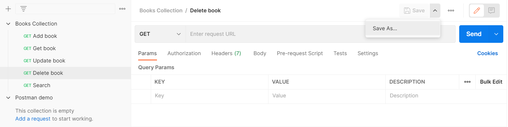
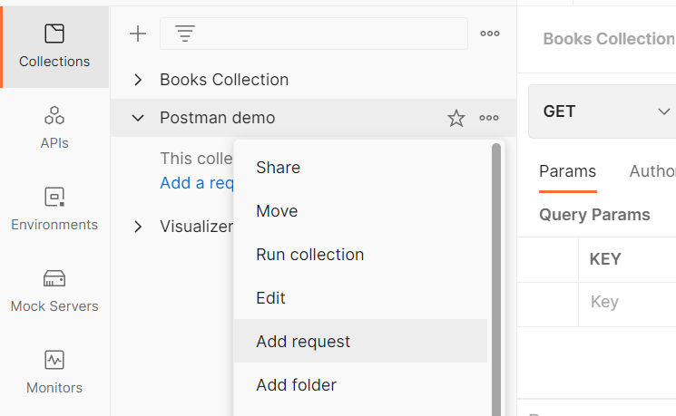

# 5 способов добавление запросов в коллекцию.

Есть несколько способов добавления запросов в коллекцию. Можно добавить новый запрос в пустую коллекцию. Для этого нужно
выбрать коллекцию и нажать на `Add a request`.

Второй способ - сохранить запрос в нужной коллекции. Для этого в окне запроса нужно нажать кнопку `Save`. В появившемся
окне выбрать нужную коллекцию либо создать новую, нажав на `New Collection`, в нижней части окна. Затем нажать `Save`
для
сохранения.

Еще один способ - переместить запрос из другой коллекции. Для этого надо выбрать нужный запрос и перетащить в новую
коллекцию. Либо после выбора запроса нажать кнопку `Save As` и выбрать нужную коллекцию в появившемся окне.

Для создания нового запроса сразу внутри нужной коллекции, необходимо нажать кнопку `View more actions`, рядом с именем
коллекции. Затем выбрать `Add Request`.

Если вы хотите включить в коллекцию один из ранее созданных запросов, выберите вкладку `History` в нижней части бокового
меню. Затем необходимо нажать на `View more actions`, рядом с именем нужного запроса. Затем выбрать `Save Request` и
выбрать нужную коллекцию в появившемся окне.
