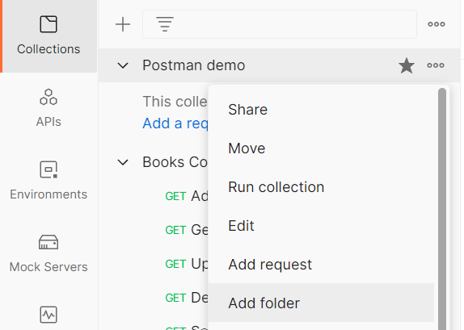
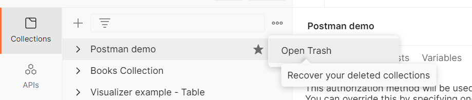

# Управление коллекцией

Для того чтобы открыть нужную коллекцию просто нажмите на ее имя в списке. Слева от имени коллекции в списке есть иконка
со стрелкой. Если нажать на нее можно открыть или скрыть содержимое коллекции. Нажатие на иконку звезды `★`, справа от
имени коллекции переместит ее в начало списка. В верхней части списка доступно окно сортировки и поиска, для более
удобного доступа к нужной коллекции. Чтобы удобнее расположить коллекции внутри списка, их можно перетаскивать. Тоже
самое можно делать с запросами и папками внутри коллекций.

Внутри коллекций можно создавать папки, для лучшей организации структуры. Для этого нажмите на
иконку `View more actions`, а затем выберите `Add folder`. Для создания дополнительных уровней вложенности внутри папок
можно создавать подпапки аналогичным образом.

Для удаления коллекции нажмите на иконку `View more actions`, а затем выберите `Delete`.

Удаленную коллекцию можно восстановить. Для этого нажмите на иконку `View more actions` рядом с панелью поиска, а затем
выберите `Open trash`. В появившемся окне рядом с коллекцией, которую хотите восстановить, нажмите на иконку `Restore`.
У восстановления удаленных коллекций есть несколько ограничений. Если у вас бесплатный аккаунт, вы сможете восстановить
только коллекции, которые были удалены в течение одного дня. Также вы не сможете восстановить большую коллекцию, размер
которой превышает 30 MB.

В Postman есть возможности для совместной работы с коллекциями. Вы можете поделиться своей коллекцией с другими
пользователями, отслеживать и откатывать сделанные в коллекции изменения. Добавлять комментарии и делать ветвления. Обо
всех этих возможностях мы поговорим в одном из следующих уроков.
