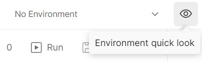
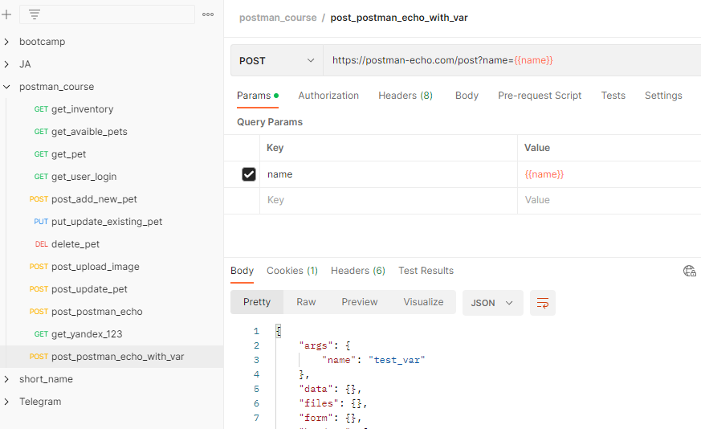

# Переменные в Postman

Переменные в Postman позволяют сохранить и повторно использовать различные значения. После создания переменной, её
значение можно использовать в коллекциях, окружениях, запросах или тестовых скриптах, ссылаясь с помощью имени этой
переменной.

Для создания переменной нажмите на иконку `Environment quick look`, в правой верхней части экрана. В разделе `Globals`
нажмите `Add`. Введите имя переменной, в столбце `Variable` и начальное значение(`Initial value`). Затем нажмите
кнопку `Save`.

Теперь мы можем использовать значение нашей переменной в одном из запросов. Откроем его из истории запросов. Значение
параметра name теперь можно заменить ссылкой на переменную name в двойных фигурных скобках. Теперь если навести на имя
переменной появится всплывающая подсказка. В ней можно увидеть имя переменной, ее значения и область видимости. Нажав на
кнопку `Send`, вы можете убедиться, что запрос работает так же, как и прежде.

## Назначение переменных

Переменные в Postman - это пары ключ-значение. Имя переменной является ключом, по которому мы к ней обращаемся для
получения доступа к ее значению. Также с помощью переменных можно передавать значения между запросами и тестами.

Таким образом в переменной мы можем хранить какие-либо данные. Для доступа к ним используется имя переменной. Добавление
переменных бывает полезно, когда нужно использовать одинаковые данные в нескольких местах. Они сделают ваши запросы
более читабельными и гибкими, поскольку теперь вы можете задавать нужные данные в одном месте.

В переменных можно хранить не только параметры, но и например часть URL. Например в разных запросах может быть
одинаковая или повторяющаяся часть адреса. Также может быть часть адреса, которая изменится в будущем. Ее удобно вынести
в переменную, чтобы затем производить изменения только в одном месте.

При использовании нескольких тестовых окружений, удобно выносить в переменные базовую часть url, поскольку она будет
отличаться. Удобно будет задавать значение переменной, отдельно для каждого из окружений.
