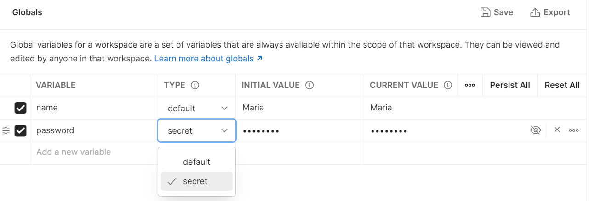
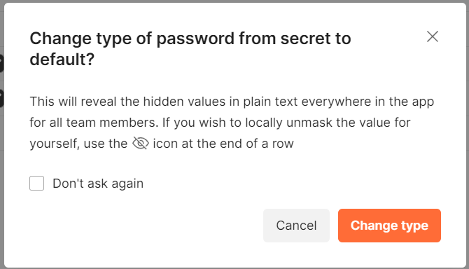

# Типы переменных

Для глобальных переменных и переменных окружения можно указать один из двух типов. Первый из них - это тип по умолчанию.
Значения переменных этого типа отображаются, как обычный текст. Второй тип - секретный, нужен для сокрытия значений.
Обычно он используется для сокрытия чувствительных данных, таких как пароли, ключи и токены. Для изменения типа
переменной пользователь должен обладать правами на редактирования для рабочего пространства(для глобальных переменных)
или окружения(для переменных окружения).

Для установки секретного типа у переменных нажмите на иконку `Environment quick look`, в правой верхней части экрана. В
разделе `Globals` нажмите `Add`. Введите имя переменной, в столбце `Variable` и начальное значение(`Initial value`).
В столбце `Type` измените тип на `Secret`. Затем нажмите кнопку `Save`.

Для изменения типа переменной с секретного на тип по умолчанию, вам потребуются права на редактирование. Во время смены
типа вам потребуется подтвердить изменение. Для этого в появившемся окне нажмите на кнопку `Change type`.

Просматривать значения секретных переменных могут все пользователи. Для этого нужно нажать на иконку с глазом, справа от
значения переменной. Менять начальные значения таких переменных могут только пользователи с правами на редактирование.
Для изменения значения, нужно также сначала нажать на иконку с изображением глаза, а затем редактировать значение.
