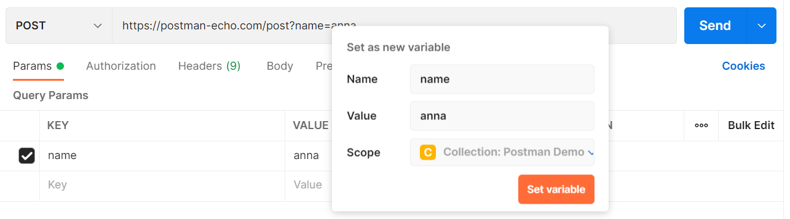

# Инициализация переменных.

Выше я уже показал один из способов добавления глобальных переменных, теперь давайте рассмотрим другие.

Первый из них - добавление из строки запроса. Для этого нужно выделить значение переменной. Во всплывающем контекстном
меню можно выбрать одну из существующих переменных. Для добавления новой переменной необходимо
выбрать `Set as variable`.

Затем нужно выбрать `Set as a new variable`. В поле name добавить имя переменной. Если нужно, вы можете поменять
значение в поле `Value`. Область видимости выбирается в поле `Scope`. Для завершения нажмите `Set variable`.

Существующим переменным можно задавать значения из тела ответа сервера. Для этого нужно выделить нужное значение. Затем
нажать правую кнопку мыши. В появившемся меню выбрать подходящие область видимости и имя переменной.

Для добавления переменной в коллекцию, выберите вкладку `Collections` в левом боковом меню. Кликните на имя нужной
коллекции. Перейдите на вкладку `Variables`. Далее всё аналогично добавлению других переменных.

В Postman есть динамические переменные, которые иногда бывает полезно использовать в своих запросах. Вот несколько
примеров таких переменных:

`{{$randomPassword}}` : Случайный пароль из 15 символов.

`{{$timestamp}}`: Текущее время в секундах.

`{{$randomInt}}`: Случайное целочисленное значение в промежутке между 0 и 1000.

Полный список динамических переменных
доступен [здесь](https://learning.postman.com/docs/writing-scripts/script-references/variables-list/).
