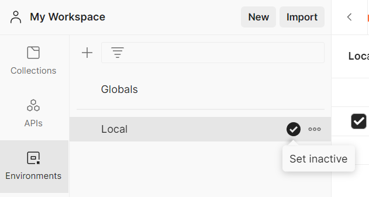

# Окружение

В Postman окружение представляет собой набор переменных. Вы можете использовать их для группировки значений и управления
доступа к ним, если используете Postman всей командой. Активное окружение отображается в правом верхнем углу, рядом с
иконкой `Environment quick look`. Там же вы можете поменять его, выбрав нужное окружение в выпадающем списке.

Для просмотра всех окружений выберите вкладку `Environments` в левом боковом меню. Здесь также можно сделать окружение
активным или неактивным. Для этого нужно нажать на иконку, справа от имени нужного окружения. Чтобы открыть окружение в
редакторе, нажмите на его имя в списке.

Для создания нового окружения на вкладке `Environments` нажмите на `+` в верхней части списка окружений.
Затем введите имя окружения. Если будете добавлять переменные окружения, не забудьте нажать кнопку `Save`.
