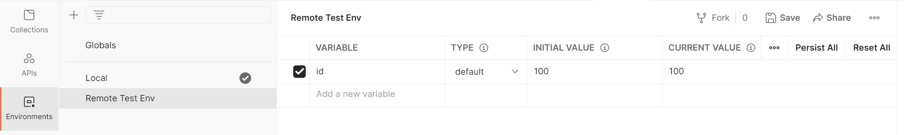
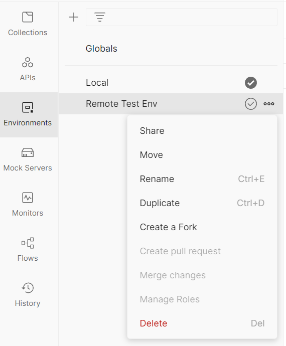

# Переменные окружения

Чтобы посмотреть переменные окружения, в левом боковом меню выберите вкладку `Environments`.
Затем кликните на имя нужного окружения.
То же самое можно сделать с помощью иконки `Environment quick look`, в правой верхней части экрана.

Для создания переменной окружения, после выбора окружения введите имя переменной, в столбце `Variable` и начальное
значение(`Initial value`). Укажите тип переменной и нажмите кнопку `Save`. Редактирование значений делается аналогично
другим типам переменных.

Для остальных операций с окружением, нужно нажать на иконку `View more actions`, справа от имени окружения. Здесь можно
удалить или переименовать окружение. Создать его копию, переместить его, а также дать доступ другим членам команды.
