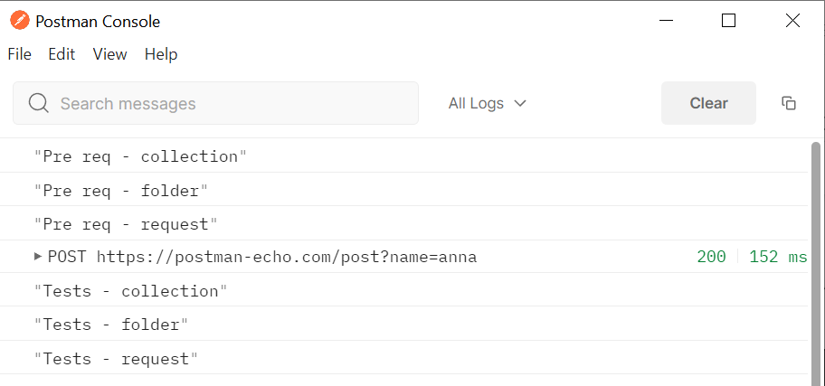

# Основные виды скриптов в Postman

Postman позволяет нам добавлять дополнительную логику к запросам и коллекциям. Это дает возможность писать API тесты и
создавать запросы, содержащие динамические параметры и передавать данные между запросами. Для этого есть два способа
добавления кода JavaScript.

Можно добавить скрипт перед отправкой запроса на сервер. Это делается на вкладке Pre-request Script. Второй способ -
добавление скрипта, который будет выполнен после получения ответа от сервера. Его можно добавить на вкладке Tests.

Оба типа скриптов можно добавлять к отдельным запросам, а также к папкам и коллекциям, в которых они находятся.

## Порядок запуска

Порядок запуска скрипта в Postman выглядит следующим образом:


До выполнения запроса выполняются pre-request скрипты. Сначала те, что были определены на уровне коллекции, затем
определенные на уровне папки и потом заданные в самом запросе. После этого выполняется запрос и мы получаем для него
ответ от сервера. После этого выполняются тестовые скрипты заданные на уровне коллекции, потом определенные для папки и
самым последним будет выполнен скрипт, который был определен для запроса.

Добавим такую команду для вывода текста в консоль в каждый из блоков (Pre req / Tests) и перед дефисом укажем название
блока. Сделаем это на каждом из уровней скриптов (Collection / Folder / Request), после дефиса укажем уровень скрипта.

```
console.log("Tests - request")
```

Запустив запрос и открыв в верхнем меню View > Show Postman Console мы увидим следующий вывод:



Как видно, сначала были выполнены блоки pre request для коллекции, папки и скрипта. Затем был отправлен запрос, а после
него выполнялись блоки тестов в аналогичном порядке.
