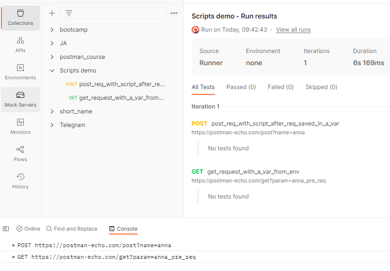

# Скрипты перед запросом

Как уже было сказано ранее скрипты, запускаемые перед запросом, можно добавить на вкладке `Pre-request Script` на уровне
коллекции, папки или запроса. Обычно они используются для предварительной обработки запроса перед отправкой на сервер.
Это может быть установка значений переменных, параметров, заголовков или тела запроса. Также вы можете выводить в
консоль, дополнительную информацию для отладки скриптов.

Для примера представьте, что у вас есть коллекция запросов. Вы запускаете их последовательно. Первый запрос возвращает
значение, которое затем нужно передать во второй запрос, но перед его отправкой, нужно сначала обработать это значение.
В данном случае, после выполнения первого запроса в тестовых скриптах мы сохраним полученное значение в переменной,
которая будет доступна также и второму запросу. В pre-request скриптах второго запроса, получим значение из переменной,
обработаем его и снова сохраним в этой переменной. Затем во втором запросе используем уже обработанное значение при
отправке запроса.

Попробуем написать скрипт, реализующий такую логику.

1. Создадим новую коллекцию. Назовем ее `Scripts demo`.
2. Добавим переменную уровня коллекции с именем `param` и значением `default`.
3. Добавим в коллекцию POST запрос:

```
POST https://postman-echo.com/post?name=anna
```

4. У него откроем вкладку `Tests`. На ней добавим код, который сохранит значение параметра из тела ответа в переменную
   param. Этот код выполнится после получения ответа от сервера.

```javascript
pm.collectionVariables.set("param", JSON.parse(responseBody).args.name)
```

5. Добавим в коллекцию GET запрос:

```
https://postman-echo.com/get?param={{param}}
```

6. На вкладке `Pre-request script` у него добавим такой код. Он выполняет преобразование значения
   и снова сохраняет его в переменную.

```javascript
var paramValue = pm.collectionVariables.get("param")
pm.collectionVariables.set("param", paramValue + "_pre_req")
```

7. Запустим всю коллекцию, нажав на `Run`. Откроем `Postman console`, для этого в верхнем меню нужно
   выбрать `View` > `Show Postman Console`.



Мы видим, что второй запрос выполнился с параметром, равным `anna_pre_req`. Первую часть мы взяли из POST запроса, а
вторую добавили в скрипте предшествующем отправке GET запроса.

Если вы хотите, чтобы скрипт запускался перед каждым запросом в коллекции, его можно добавить на вкладке `Pre-request
script` нужной коллекции. Тоже самое можно сделать для папок внутри коллекции.

## Test

У нас есть глобальная переменная param = global. Будем использовать ее в запросе:

`https://postman-echo.com/get?name={{param}}`

У запроса на вкладке pre-request script добавим такой код:

`pm.variables.set("param", "other");`

После нажатия на кнопку Send, с каким значением параметра name будет выполнен запрос?

> "other"
