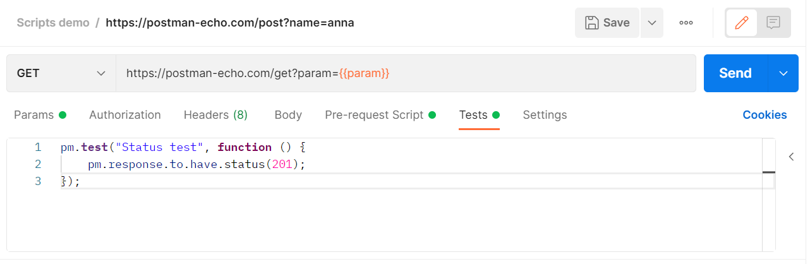

# Тестовые скрипты

Используя тестовые скрипты в Postman, вы можете проверить правильность работы API, сравнив результат с ожидаемым
поведением или для отладки вывести какие либо значения после получения ответа от сервера.

Тестовые скрипты, также как и скрипты выполняемые перед запросом, можно добавлять не только к отдельным запросам, но и к
коллекциям или папкам. Также в Postman есть готовые куски кода (code snippets) для стандартных задач, которые вы можете
модифицировать под свои задачи.

Для добавления тестового скрипта к запросу вам потребуется открыть вкладку `Tests` и ввести туда свой код. Он будет
запущен после выполнения запроса. Результат запуска тестовых скриптов будет доступен на вкладке `Test Results` ответа от
сервера. В тестовых скриптах можно использовать динамические переменные. Добавлять проверки для данных из ответа и
передавать полученные значения между запросами.
