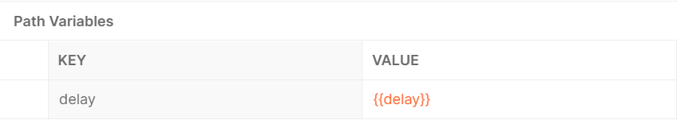
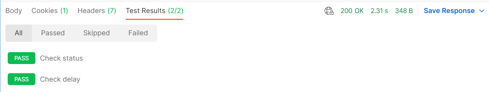
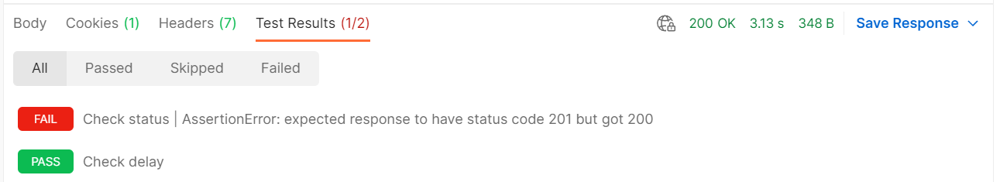
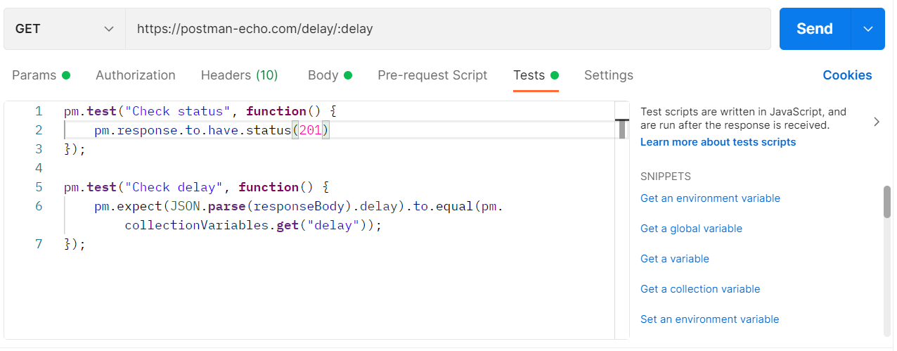

# Проверка ответа

В Postman есть несколько готовых сущностей, облегчающих проверку ответа:

+ Для проверки данных, полученных в ответе мы можем использовать в скрипте pm.response.
+ Создать тесты можно с помощью функции `pm.test`. Первый параметр - это строка, которая будет отображена в результатах
  выполнения теста. Во втором параметре передается функция, которая возвращает `true` или `false`. При значение `true`,
  тест отмечается как успешно выполненный. При значении `false` тест считается упавшим с ошибкой.
+ Еще один способ добавления проверки в скрипт - `pm.expect`.

Давайте создадим новый тестовый скрипт и добавим в него несколько проверок для полученного ответа. Проверки будем делать
для запроса:

```
GET https://postman-echo.com/delay/:delay
```

Добавим в коллекцию новую переменную delay и зададим ей значение 2.



Будем использовать ее в качестве path параметра для нашего запроса. Откроем вкладку Tests. Добавим следующий код:

```javascript
pm.test("Check status", function() {
    pm.response.to.have.status(200)
});

pm.test("Check delay", function() {
    pm.expect(pm.response.json().delay).to.equal(pm.collectionVariables.get("delay"));    
});
```

В первом вызове `pm.test`, мы проверяем что код ответа равен 200. Во втором проверяем, что в теле ответа
значение `delay`,
совпадает со значением переменной коллекции, которую мы использовали при отправке запроса. Давайте нажмем кнопку `Send`
и выполним наш запрос. Затем откроем вкладку `Test Results`.



Возле названия вкладки мы видим количество тестов прошедших успешно, а также общее количество тестов. На самой вкладке
мы видим результат выполнения тестов. Также доступны фильтры, для показа : всех тестов, а также только успешных, только
упавших и только пропущенных.

Давайте поменяем ожидаемое значение в первой проверке на 201 и снова выполним запрос.



Как мы и ожидали, первая проверка упала, т.к. ожидаемый код ответа не соответствует полученному. Сама проверка теперь
отмечена красным цветом. Детали ошибки доступны, рядом с описанием.

Postman содержит набор готовых сниппетов, для часто встречающихся задач. Они находятся справа от редактора тестовых
скриптов.



Среди них есть например получение, установка и очистка значений переменных, проверка кода, заголовков и тела ответа и
другие часто используемые проверки. Для использования, просто нажмите на название нужного сниппета и он появится в
редакторе. Вам останется лишь модифицировать его под свой случай использования. Использование сниппетов ускорит ваш
процесс написания тестовых скриптов.
