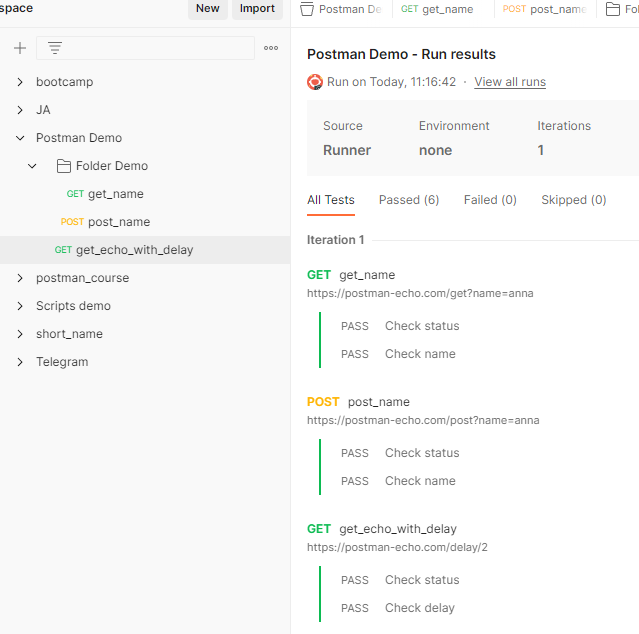

# Скрипты для коллекций и папок

Тестовые скрипты можно добавлять не только к отдельным запросам, но и на уровне папок и коллекций. Скрипт добавленный
для коллекции, будет запущен после выполнения каждого запроса, из этой коллекции. Скрипт добавленный на уровне папки,
будет запущен после каждого запроса, находящегося в этой папке. Такой механизм позволяет удобно организовать часто
используемые скрипты. Порядок запуска такой: сначала запускаются скрипты определенные на уровне коллекции, затем
объявленные на уровне папки и последними будут выполнены скрипты, заданные на уровне запроса.

Чтобы добавлять или редактировать скрипты для коллекции, нужно выбрать нужную коллекцию и перейти на вкладку `Tests`.
Для папки все аналогично. Давайте посмотрим, как выглядит отчет со скриптами, добавленными на разных уровнях.

Создадим новую коллекцию, назовем ее `Postman Demo`. В ней создадим новую папку, с именем `Folder Demo`. Внутри папки
добавим два запроса:

```
GET https://postman-echo.com/get?name={{name}}
```

```
POST https://postman-echo.com/post?name={{name}}
```

На уровне коллекции добавим переменную `name` со значением `anna` и переменную `delay`,
значение которой будет равно 2.

Внутри коллекции добавим еще один запрос :

```
GET https://postman-echo.com/delay/:delay
```

Параметр `delay` будет задаваться из переменной коллекции с таким же именем. Теперь давайте добавим скрипт на уровне
последнего GET запроса:

```javascript
pm.test("Check delay", function() {
    pm.expect(pm.response.json().delay).to.equal(pm.collectionVariables.get("delay"));    
});
```

Еще один тестовый скрипт будет на уровне папки.
Он будет запущен только для двух запросов, которые находятся в этой папке:

```javascript
pm.test("Check name", function() {
    pm.expect(pm.response.json().args.name).to.equal("anna");    
});
```

Последний тестовый скрипт добавим на уровне коллекции. Он будет запущен для всех трех запросов:

```javascript
pm.test("Check status", function() {
    pm.response.to.have.status(200)
});
```

Запустим всю коллекцию.



Для каждого из запросов видим запуски тестовых скриптов. Для первого и второго запросов, находящихся в папке Folder
Demo, сначала выполнились тестовые скрипты, заданные на уровне коллекции, затем на уровне папки. Третий скрипт не
находится в папке, поэтому для него выполнился скрипт уровня коллекции и скрипт, который мы задавали для самого запроса.
